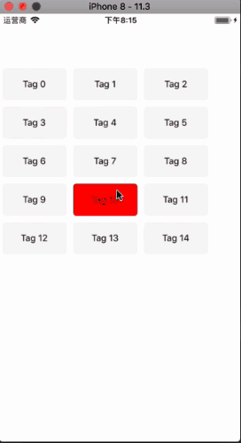
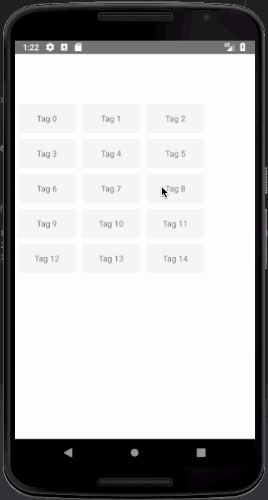

# react-native-drag-to-sort-tags

**react-native-drag-to-sort-tags** 是一个可拖动排序的标签组件(iOS & Android)，并且在安卓上做了性能优化，滑动的流畅度表现良好。

## 功能

* 拖动标签排序
* 在安卓上更好的性能表现，更流畅的滑动响应
* 较完善的自定义功能
* 支持单击选择以选中标签，标签自动排序
* 支持屏幕旋转
* 支持TypeScript

## 预览




## 接入步骤

该项目依赖 [react-native-gesture-handler](https://github.com/kmagiera/react-native-gesture-handler), 在接入本库之前请先阅读[react-native-gesture-handler接入文档](https://kmagiera.github.io/react-native-gesture-handler/docs/getting-started.html#installation)正确接入react-native-gesture-handler

大概步骤就是：
```$xslt
yarn add react-native-gesture-handler
react-native link react-native-gesture-handler
```

如果不是是用native-navigation或者react-native-navigation则可以直接修改安卓代码

```$xslt
package com.swmansion.gesturehandler.react.example;

import com.facebook.react.ReactActivity;
+ import com.facebook.react.ReactActivityDelegate;
+ import com.facebook.react.ReactRootView;
+ import com.swmansion.gesturehandler.react.RNGestureHandlerEnabledRootView;

public class MainActivity extends ReactActivity {

  @Override
  protected String getMainComponentName() {
    return "Example";
  }

+  @Override
+  protected ReactActivityDelegate createReactActivityDelegate() {
+    return new ReactActivityDelegate(this, getMainComponentName()) {
+      @Override
+      protected ReactRootView createRootView() {
+       return new RNGestureHandlerEnabledRootView(MainActivity.this);
+      }
+    };
+  }
}
```
iOS则不用修改。

如果是使用native-navigation或者react-native-navigation，则需要修改JavaScript代码

```$xslt
import { gestureHandlerRootHOC } from 'react-native-gesture-handler'
import { Navigation } from 'react-native-navigation';
import YourScreen from './YourScreen';

export function registerScreens() {
  Navigation.registerComponent('example.FirstTabScreen', () =>
    gestureHandlerRootHOC(YourScreen));
}
```

如此，[react-native-gesture-handler](https://github.com/kmagiera/react-native-gesture-handler)就已经安装完成。

接下来安装react-native-drag-to-sort-tag：

`$ npm install react-native-drag-to-sort-tag --save`

如果需要长按后的震动反馈功能，安卓需要额外配置：在AndroidManifest.xml中添加下面的代码
```$xslt
<uses-permission android:name="android.permission.VIBRATE"/>
```

## Usage

### 示例：

```$xslt
import React from "react";
import { StyleSheet, Text, View } from "react-native";
import { DragToSortTags } from "react-native-drag-to-sort-tags";

export class DragToSortTagsSample extends React.Component{
  render() {
    const tags = [];
    for (let i = 0; i < 15; ++i) {
      tags.push("Tag " + i);
    }
    return (
      <View style={styles.container}>
        <DragToSortTags
          style={styles.container}
          tags={tags}
          renderTag={this._renderTag}
        />
      </View>
    );
  }

  _renderTag = (tag: string) => {
    return (
      <View style={styles.button}>
        <Text style={styles.text}>{tag}</Text>
      </View>
    );
  };
}

const styles = StyleSheet.create({
  container: {
    flex: 1,
    marginTop:40,
    backgroundColor: "white"
  },
  button: {
    width: 100,
    height: 50,
    backgroundColor: "#F3F3F3",
    borderRadius: 5,
    justifyContent: "center",
    alignItems: "center"
  }
});
```

### 属性

属性  |  类型  |  默认值  |  作用  
---- | ------ | --------- | --------
tags | string[] | **必须** | 显示的所有标签
renderTag | (tag: string) => React.ReactElement<View> | **必须** | 每个标签的render函数
marginHorizontal | number | 5 | 标签之间的横向间隔
marginVertical | number | 5 | 标签之间的纵向间隔
colorForSelected | Color | 'red' | 标签单击后的选中背景颜色
opacityForDragged | number | 0.6 | 拖拽的标签的不透明度
onTagsSorted | (tags: string[]) => any | ()=>null | 所有标签排序发生变动的时候的回调函数
fixBorderRadiusOnAndroid | boolean | true | 是否启用修正react-native-gesture-handler在安卓上borderRadius单位错误的bug
selectable | boolean | true | 标签是否可以单击选择
onSelectChange | (selectedTags: string[]) => any | ()=>null | 选中标签或其顺序发生变化时的回调
maxCountSelectable | number | 0 | 最大可选择的标签数量（0表示无限制）
vibration | number | 40 | 长按时的震动反馈时长，<=0表示不震动（该功能在安卓上需要配置权限）
initSelectedTags | string[] | [] | 初始化选中的标签
longPressResponseTime | number | 500 | 长按最小响应时长(浩渺)

### 方法：

*getSortedTags(): string[];*

获取已经当前所有标签的排序顺序

*getSelectedTags(): string[]*

获取当前选择的标签（已排序）


## 注意事项
* vibration 在安卓上需要配置权限：在AndroidManifest.xml中添加下面的代码
```$xslt
<uses-permission android:name="android.permission.VIBRATE"/>
```

* 有关 renderTag：

   1. 目前暂时只支持等宽且等高的标签元素。
   2. renderTag返回的顶层元素是没有实际意义的，最终会将其属性全部转化到一个可以支持同时手势的BaseButton上面。
   3. renderTag的顶层元素的样式中，margin系列值均无效，需要设置margin的话，请通过设置DragToSortTags的marginHorizontal和marginVertical属性
   4. renderTag的顶层元素的样式中，transform和zIndex属性均是无效的，该属性已经用于制作拖动动画
   5. BaseButton现行版本中存在一个bug：borderRadius在Android上单位错误，所以本库开启了一个修复选项fixBorderRadiusOnAndroid。如果react-native-gesture-handler在未来的版本修复了这个问题，您可以手动关闭这个修复功能。
   6. BaseButton现行版本borderWith无效
 

  